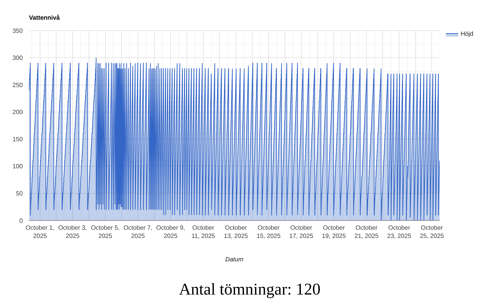
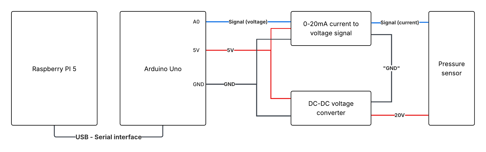
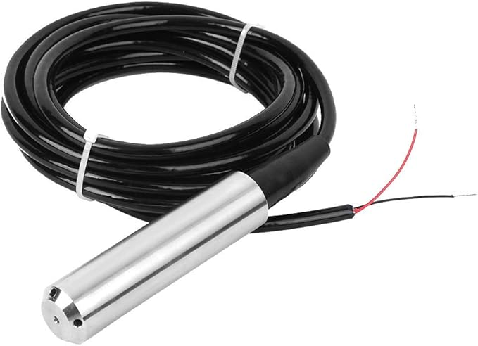

# water_level
Repository containing the code for a Raspberry Pi + Arduino setup to measure, store, and visualize the water level in a well over time.

Example from a well for temporary storage of drainage water before being pumped away, also indicates how many time the pump emptied the well during the time period. (text in Sweidsh).
 

## System description

### The components are:
- Raspberry Pi 5
- Ardunio Uno
- TIL-136 liquid level sensor
- A current to voltage module 0-20mA
- A dc step up converter

The liquid level sensor, which submerges in water and is based on pressure readings.

### Description
The liquid level sensors requires 20V and outputs a signal of 0-20mA. The dc step up converter was set to increase voltage from 5V to 20V. The current to voltage signal was set to output a voltage in range 0-5V linearly base on the current signal input 0-20mA. 

That voltage signal is read by the arduino and sent to the raspberry pi through the serial interface. The arduino then waits 1s before repeating the read and send operation.

The raspberry pi runs three functions.
- A python script that receives the serial message, takes the median over 3 minutes and stores it in a database.
- The MariaDB SQL database for storage.
- An apache2 server with php scripts that visualise the values stored in the database.

### Software and code
- Raspberry PI, see the markdown in the setup folder and the files in php_code and python_code folders.
- Arduino, uses the simple voltage measurement example in a lightly modified version.